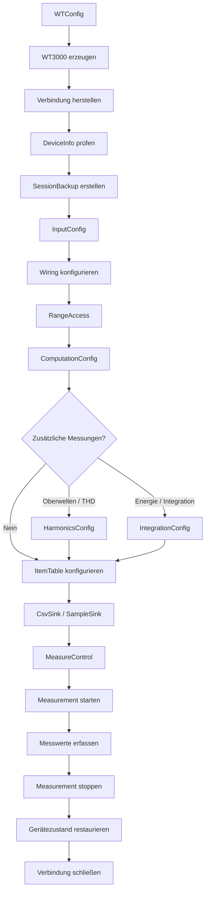

# WT3000-Treiber: Wichtige Klassen für automatisierte 3-Phasen-Motormessungen

## Ziel

Dieses Dokument priorisiert die Klassen des Yokogawa-WT3000-Treibers für automatisierte Messungen an 3-Phasen-Motoren.

Dabei wird zwischen zwei Dingen unterschieden:

1. **Wichtigkeit einer Klasse für die Messung**
2. **Sinnvolle Aufrufreihenfolge im Automatisierungsskript**

Wichtig: Das Automatisierungsskript sollte möglichst nicht direkt mit internen Transport-, Protokoll- oder Hilfsklassen arbeiten. Die zentrale Schnittstelle sollte die `WT3000`-Klasse sein.

---

# 1. Wichtigste Klassen nach Priorität

| Rang | Klasse | Bedeutung für die Messung |
|---:|---|---|
| 1 | `WT3000` | Zentrale Schnittstelle des Treibers und Einstiegspunkt für alle Teilbereiche |
| 2 | `MeasureControl` | Führt die eigentliche Messwerterfassung aus |
| 3 | `InputConfig` | Konfiguriert Messeingänge, Elemente und Eingangseinstellungen |
| 4 | `ItemAccess` / `ItemTable` | Legt fest, welche Messgrößen vom WT3000 gelesen werden |
| 5 | `RangeAccess` | Setzt Strom- und Spannungsmessbereiche |
| 6 | `ComputationConfig` | Konfiguriert Berechnungen, Mittelung, Synchronisierung usw. |
| 7 | `WTConfig` | Enthält Verbindungs- und Treiberkonfiguration |
| 8 | `Wiring` / `WiringUnit` | Beschreibt die elektrische Verschaltung der Messelemente |
| 9 | `Measurement` | Repräsentiert eine laufende Messung |
| 10 | `SampleSink` / `CsvSink` | Speicherung und Weitergabe der Messdaten |
| 11 | `HarmonicsConfig` | Oberwellen- und THD-Messung, besonders wichtig bei Frequenzumrichtern |
| 12 | `IntegrationConfig` | Energie- und Zeitintegrationsmessungen |
| 13 | `SessionBackup` | Sichert und restauriert den Gerätezustand |
| 14 | `DeviceInfo` | Identifikation und Plausibilitätsprüfung des Messgeräts |
| 15 | `ErrorPolicy` | Definiert Verhalten bei Kommunikations- oder Messfehlern |
| 16 | `LoopStatistics` | Überwachung der Messschleife |
| 17 | `RunMetadata` | Metadaten und Dokumentation des Messlaufs |
| 18 | `Sample` | Repräsentiert einen einzelnen Messdatensatz |
| 19 | `NumericItem` / `NumericValue` | Datenmodelle für Messgrößen und Messwerte |
| 20 | `InputSnapshot` / `RangeBackup` | Sichern und Wiederherstellen einzelner Gerätezustände |

---

# 2. Zentrale Klassenkette

Für automatisierte Motorprüfstandsmessungen ist folgende Kette besonders relevant:

```text
WT3000
  ↓
InputConfig / Wiring
  ↓
RangeAccess
  ↓
ComputationConfig
  ↓
ItemTable
  ↓
MeasureControl
  ↓
Measurement
```

Diese Klassen bilden die eigentliche öffentliche Mess-API.

Zusätzliche Klassen wie `HarmonicsConfig`, `IntegrationConfig`, `CsvSink` oder `SessionBackup` ergänzen diese Kernkette.

---

# 3. Empfohlene Aufrufreihenfolge

```text
1. WTConfig
       ↓
2. WT3000
       ↓
3. Verbindung / Session
       ↓
4. DeviceInfo prüfen
       ↓
5. Gerätezustand sichern
       ↓
6. InputConfig + Wiring
       ↓
7. RangeAccess
       ↓
8. ComputationConfig
       ↓
9. HarmonicsConfig        [optional]
       ↓
10. IntegrationConfig     [optional]
       ↓
11. ItemAccess / ItemTable
       ↓
12. SampleSink / CsvSink
       ↓
13. MeasureControl
       ↓
14. Measurement
       ↓
15. Sample / NumericValue
       ↓
16. Messung stoppen
       ↓
17. Gerätezustand wiederherstellen
       ↓
18. Verbindung schließen
```

---

# 4. Empfohlener Gesamtworkflow



---

# 5. `WTConfig`

`WTConfig` sollte am Anfang des Skripts stehen.

Typische Aufgaben:

- IP-Adresse / Host des WT3000
- Kommunikationsparameter
- Timeout
- Treiberoptionen
- Reconnect-Verhalten

Beispielhafte Struktur:

```python
config = WTConfig(...)
wt = WT3000(config)
```

---

# 6. `WT3000`

`WT3000` ist die wichtigste Klasse der gesamten Bibliothek.

Sie sollte als zentrale Fassade für die verschiedenen Treiberbereiche dienen.

Typischer Zugriff:

```python
wt.input
wt.ranges
wt.items
wt.measure
wt.computation
wt.harmonics
wt.integration
wt.session
```

Das Automatisierungsskript sollte möglichst ausschließlich über diese öffentliche Schnittstelle arbeiten.

---

# 7. `DeviceInfo`

Nach dem Verbindungsaufbau sollte geprüft werden, ob tatsächlich das erwartete Gerät verbunden ist.

Mögliche Prüfungen:

- Hersteller
- Modell
- Seriennummer
- Firmware
- unterstützte Optionen

Dadurch kann verhindert werden, dass ein Messskript versehentlich mit einem falsch konfigurierten oder unerwarteten Gerät arbeitet.

---

# 8. `SessionBackup`

Vor Änderungen an der Gerätekonfiguration sollte der bestehende Zustand gesichert werden.

Empfohlenes Muster:

```python
backup = wt.session.backup()

try:
    # Messung durchführen
    ...
finally:
    wt.session.restore(backup)
    wt.close()
```

Damit wird der WT3000 nach einem normalen Ende oder einem Fehler wieder in seinen ursprünglichen Zustand versetzt.

---

# 9. `InputConfig`

`InputConfig` gehört zu den wichtigsten Klassen für Motorprüfstandsmessungen.

Sie konfiguriert unter anderem:

- Messelemente
- Spannungs- und Stromeingänge
- Sensorverhältnisse
- Skalierungsfaktoren
- Filter
- Synchronisation der Eingangssignale

Bei einer 3-Phasen-Messung müssen die Messelemente korrekt den Phasen zugeordnet werden.

Beispiel:

```text
Element 1 → Phase L1
Element 2 → Phase L2
Element 3 → Phase L3
```

Eine fehlerhafte Eingangskonfiguration kann später nicht durch Softwareberechnungen kompensiert werden.

---

# 10. `Wiring` / `WiringUnit`

Die Wiring-Konfiguration legt fest, wie die Messelemente elektrisch zusammengehören.

Beispiele:

- 3P3W
- 3P4W
- weitere vom WT3000 unterstützte Verschaltungen

Für einen Motorprüfstand muss die Konfiguration exakt zum realen Messaufbau passen.

---

# 11. `RangeAccess`

`RangeAccess` legt die Spannungs- und Strommessbereiche fest.

Beispiele:

```text
Spannungsbereich: 600 V
Strombereich:      20 A
```

oder automatische Bereichswahl:

```text
AutoRange
```

## Empfehlung für automatisierte Messreihen

Für reproduzierbare Messungen sind feste Bereiche häufig vorzuziehen.

Vorteile:

- bessere Vergleichbarkeit der Messpunkte
- keine Bereichsumschaltung während eines Messpunkts
- weniger transiente Effekte
- reproduzierbareres Messverhalten

AutoRange kann sinnvoll sein, um vor Beginn einer Messreihe geeignete Bereiche zu bestimmen.

---

# 12. `ComputationConfig`

Diese Klasse konfiguriert die interne Verarbeitung der Messwerte.

Für Motorprüfstände können insbesondere relevant sein:

- Mittelwertbildung
- Synchronisationsquelle
- Leistungsberechnung
- Wirkungsgradberechnung
- Formeldefinitionen
- SQ-Formeln

Typische Messgrößen:

```text
U_RMS
I_RMS
P
S
Q
PF
f
η
```

---

# 13. Mittelwertbildung

Motor- und insbesondere Umrichtermessungen können stark schwanken.

Eine geeignete Mittelwertbildung verbessert die Stabilität und Reproduzierbarkeit.

Dazu gehören beispielsweise:

- Anzahl der Mittelungen
- Mittelungszeit
- gleitende Mittelwerte
- exponentielle Mittelung

Die Konfiguration sollte vor Beginn der Messdatenerfassung erfolgen.

---

# 14. Synchronisation

Die Synchronisationsquelle ist für korrekte Leistungsberechnungen wichtig.

Eine ungeeignete Synchronisation kann die Genauigkeit bei:

- Spannung
- Strom
- Leistung
- Leistungsfaktor
- Oberwellen

deutlich beeinflussen.

---

# 15. `HarmonicsConfig`

`HarmonicsConfig` ist optional, kann aber bei Motorprüfständen sehr wichtig werden.

## Direkt netzgespeister Motor

Priorität: **mittel**

## Motor hinter Frequenzumrichter

Priorität: **hoch**

Typische Messgrößen:

- THD
- Grundschwingung
- einzelne Harmonische
- Spannungsoberwellen
- Stromoberwellen

Mögliche zugehörige Einstellungen:

- `HarmonicsSettings`
- `FrequencyBand`
- `IecGrouping`
- `ThdFormula`

Bei umrichtergespeisten Motoren sollte `HarmonicsConfig` direkt nach `ComputationConfig` eingeordnet werden.

---

# 16. `IntegrationConfig`

`IntegrationConfig` ist hauptsächlich für zeitintegrierte Größen relevant.

Beispiele:

- Wh
- Ah
- integrierte Leistung
- Energieverbrauch während eines Fahrzyklus
- Energieverbrauch während einer definierten Messdauer

Für einen einzelnen stationären Betriebspunkt ist diese Klasse meist nicht erforderlich.

Beispiel:

```text
3000 rpm
25 Nm

→ Spannung messen
→ Strom messen
→ Leistung messen
→ Leistungsfaktor messen
```

Hier reicht normalerweise die reguläre Messwerterfassung.

---

# 17. `ItemAccess` / `ItemTable`

Diese Klassen legen fest, welche Messgrößen vom WT3000 ausgelesen werden.

Für eine 3-Phasen-Motormessung könnte die Tabelle beispielsweise enthalten:

```text
U1
U2
U3

I1
I2
I3

P1
P2
P3

P_SUM

PF1
PF2
PF3

Frequency
```

Optional:

```text
THD_U
THD_I
Efficiency
Energy
```

## Empfehlung

Die `ItemTable` sollte einmal vor Beginn der Messschleife erstellt werden.

Gut:

```python
table = create_item_table()

while measuring:
    values = wt.measure.read_mapped(table)
```

Weniger sinnvoll:

```python
while measuring:
    table = create_item_table()
    values = wt.measure.read_mapped(table)
```

Die Messwertdefinition sollte während einer Messreihe möglichst konstant bleiben.

---

# 18. `MeasureControl`

`MeasureControl` ist das Herzstück der eigentlichen Messwerterfassung.

Typische Funktionen können sein:

```text
read_mapped(...)
read_values(...)
record(...)
record_csv(...)
start(...)
stop_active(...)
stream(...)
hold(...)
```

## Einzelmessung

Geeignet für diskrete Betriebspunkte:

```python
values = wt.measure.read_mapped(table)
```

Typischer Ablauf:

```text
Betriebspunkt einstellen
        ↓
auf stabilen Zustand warten
        ↓
WT3000 auslesen
        ↓
Messwerte speichern
        ↓
nächsten Betriebspunkt einstellen
```

## Kontinuierliche Messung

Für zeitabhängige Messungen:

```python
for sample in wt.measure.stream(...):
    ...
```

## Automatische Aufzeichnung

Wenn vom Treiber unterstützt:

```python
wt.measure.record(...)
```

oder

```python
wt.measure.record_csv(...)
```

Wenn möglich, sollte diese Funktionalität gegenüber einer selbst implementierten Polling-Schleife bevorzugt werden.

---

# 19. `Measurement`

`Measurement` repräsentiert eine laufende Messung.

Typische Funktionen:

```text
start()
stop()
wait()
is_running
error
stats
```

Beispiel:

```python
measurement = wt.measure.start(...)

# Messung läuft

measurement.stop()
measurement.wait()
```

Die Messlogik bleibt dadurch innerhalb der Treiberbibliothek.

---

# 20. `SampleSink` / `CsvSink`

Die Sink-Klassen übernehmen die Speicherung oder Weitergabe der Messwerte.

Mögliche Hierarchie:

```text
SampleSink
   │
   ├── CsvSink
   ├── JsonSink
   ├── CallbackSink
   ├── MultiSink
   └── RotationSink
```

Für klassische Motorprüfstandsmessungen ist `CsvSink` besonders relevant.

Vorteil:

Das Automatisierungsskript muss nicht selbst CSV-Zeilen formatieren und schreiben.

---

# 21. Datenklassen

Folgende Klassen sind wichtig, müssen vom Messskript aber normalerweise nicht aktiv gesteuert werden:

```text
Sample
NumericItem
NumericValue
ElementSettings
ElementRangeState
RangeSpec
RangeValue
RangePlan
RangeReport
ComputationSettings
AveragingSettings
HarmonicsSettings
IntegrationSettings
RunMetadata
LoopStatistics
```

Sie repräsentieren hauptsächlich:

- Konfigurationen
- Messwerte
- Statusinformationen
- interne Datenstrukturen

---

# 22. Interne Treiberklassen

Klassen wie:

```text
Transport
TmctlTransport
ReconnectableTransport
FakeTransport
```

sind für die Treiberimplementierung wichtig.

Das Automatisierungsskript sollte jedoch möglichst keine direkte Abhängigkeit von ihnen besitzen.

Die Abstraktion sollte ungefähr so aussehen:

```text
Automatisierungsskript
        ↓
      WT3000
        ↓
Treiber-Subsysteme
        ↓
Transport
        ↓
TMCTL / Ethernet
        ↓
Yokogawa WT3000
```

---

# 23. Exception- und Fehlerklassen

Exception-Klassen sind für robuste Fehlerbehandlung relevant, gehören aber nicht zum normalen Messablauf.

Beispiele:

```text
ProtocolError
DeviceError
InputError
ConfigLocked
```

Das Automatisierungsskript sollte die wichtigsten öffentlichen Exceptions behandeln.

Beispiel:

```python
try:
    measurement = wt.measure.start(...)
except DeviceError:
    ...
except ProtocolError:
    ...
finally:
    ...
```

---

# 24. Empfohlene Struktur eines Motor-Messskripts

```python
config = WTConfig(...)

wt = WT3000(config)

try:
    # 1. Verbindung
    wt.connect()

    # 2. Gerät prüfen
    device_info = wt.device_info

    # 3. Zustand sichern
    backup = wt.session.backup()

    # 4. Eingänge konfigurieren
    wt.input.configure(...)

    # 5. Verschaltung konfigurieren
    wt.input.wiring.configure(...)

    # 6. Messbereiche setzen
    wt.ranges.configure(...)

    # 7. Berechnungen konfigurieren
    wt.computation.configure(...)

    # 8. Optional: Oberwellen
    # wt.harmonics.configure(...)

    # 9. Optional: Integration
    # wt.integration.configure(...)

    # 10. Messgrößen definieren
    table = wt.items.create_table(...)

    # 11. Messung starten
    measurement = wt.measure.start(...)

    # 12. Messdaten erfassen
    ...

    # 13. Messung stoppen
    measurement.stop()
    measurement.wait()

finally:
    # 14. Ursprünglichen Gerätezustand wiederherstellen
    wt.session.restore(backup)

    # 15. Verbindung schließen
    wt.close()
```

Die konkreten Methodennamen hängen von der tatsächlichen API der Bibliothek ab. Entscheidend ist die Reihenfolge der funktionalen Schritte.

---

# 25. Empfohlene Reihenfolge für einen einzelnen Prüfpunkt

Beispiel:

```text
Drehzahl:   3000 rpm
Drehmoment: 25 Nm
```

Ablauf:

```text
Motorbetriebspunkt einstellen
        ↓
auf stabilen Zustand warten
        ↓
Messgerät ggf. auf Hold / Trigger vorbereiten
        ↓
Messwerte über MeasureControl erfassen
        ↓
Sample erzeugen
        ↓
Messwerte speichern
        ↓
Messpunkt beenden
        ↓
nächsten Betriebspunkt anfahren
```

Die grundlegende WT3000-Konfiguration sollte dabei nicht für jeden Messpunkt neu durchgeführt werden.

---

# 26. Trennung zwischen einmaliger Konfiguration und Messschleife

## Einmal vor der Messreihe

```text
WTConfig
WT3000
Verbindung
DeviceInfo
SessionBackup
InputConfig
Wiring
RangeAccess
ComputationConfig
HarmonicsConfig
IntegrationConfig
ItemTable
CsvSink
```

## Für jeden Messpunkt

```text
Betriebspunkt einstellen
        ↓
stabilisieren
        ↓
MeasureControl
        ↓
Sample
        ↓
Messwerte speichern
```

## Einmal nach der Messreihe

```text
Measurement stoppen
        ↓
SessionBackup restaurieren
        ↓
Verbindung schließen
```

Diese Trennung ist für eine effiziente automatisierte Messung besonders wichtig.

---

# 27. Zusammenfassung

Für automatisierte 3-Phasen-Motormessungen bilden folgende Klassen den Kern:

```text
WTConfig
    ↓
WT3000
    ↓
InputConfig
    ↓
Wiring
    ↓
RangeAccess
    ↓
ComputationConfig
    ↓
ItemTable
    ↓
MeasureControl
    ↓
Measurement
```

Optional:

```text
HarmonicsConfig
IntegrationConfig
CsvSink
SessionBackup
```

Die zentrale Priorisierung lautet:

> **`WT3000 → InputConfig/Wiring → RangeAccess → ComputationConfig → ItemTable → MeasureControl → Measurement`**

Transport-, Datenmodell- und Exception-Klassen sind für die Bibliothek selbst wichtig, sollten aber im normalen Automatisierungsskript möglichst hinter der öffentlichen API verborgen bleiben.

Für einen Motor, der über einen Frequenzumrichter gespeist wird, sollte `HarmonicsConfig` deutlich höher priorisiert und direkt nach `ComputationConfig` eingeordnet werden.
